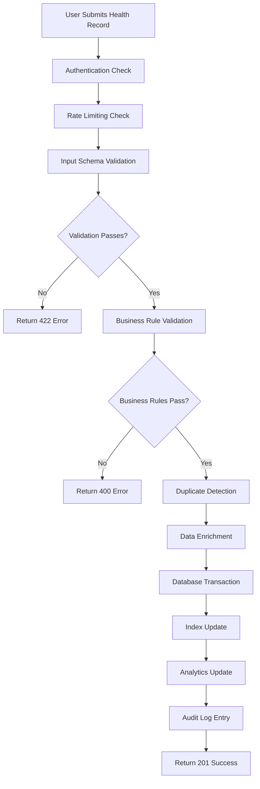
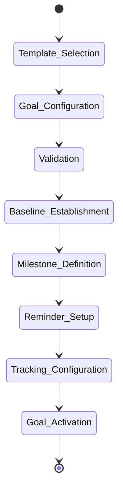
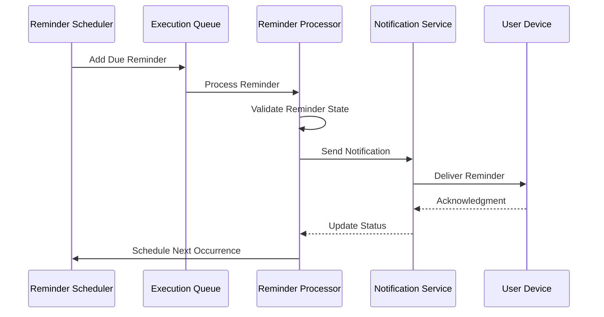
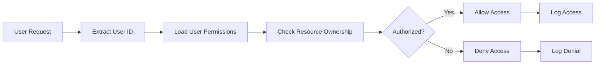
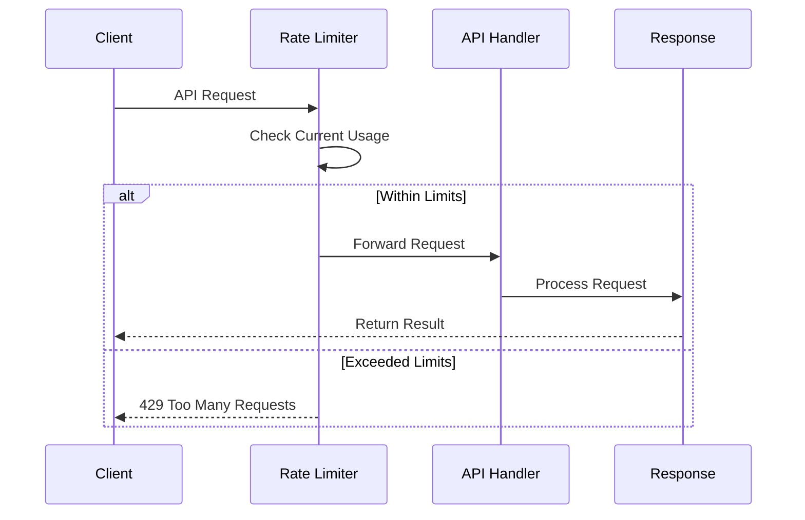
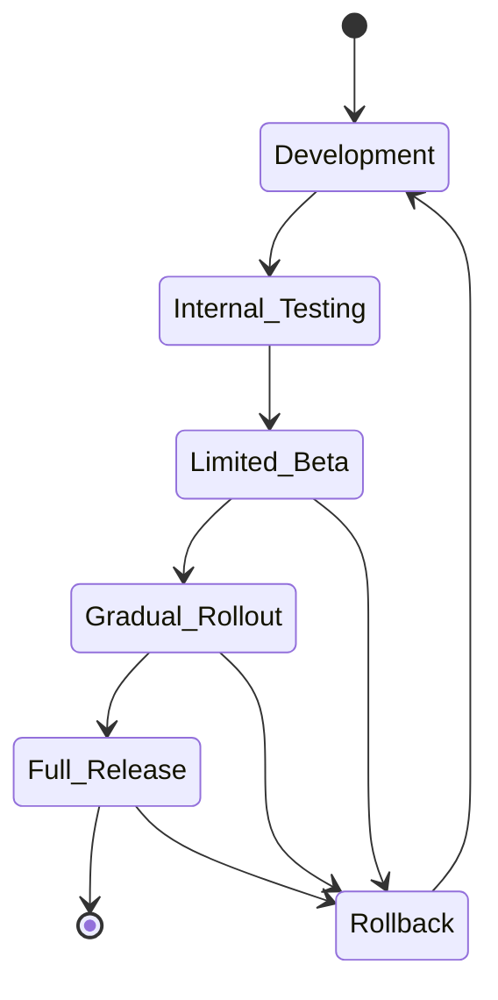
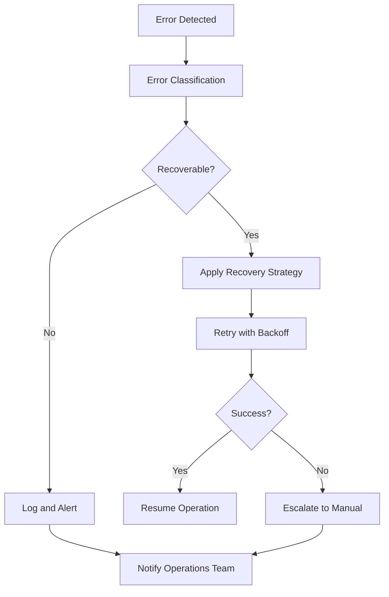

# Business Workflow Patterns Analysis

This document provides a detailed analysis of business workflows mapped from validation patterns and API implementations in the health management system.

## Health Record Management Workflow

### Complete Health Record Creation Workflow

#### Validation Checkpoints

Based on `src/validations/HealthRecordValidation.ts`:

1. **Schema Validation**
   - `recordType`: Must be one of predefined health record types
   - `value`: Numeric value with appropriate precision and range
   - `unit`: Must match expected units for the record type
   - `recordedAt`: Valid ISO date string, cannot be in the future
   - `notes`: Optional string with maximum length constraints

2. **Business Rule Enforcement**
   - **Physiological Ranges**: Values must fall within medically reasonable ranges
   - **Unit Consistency**: Units must be appropriate for the measurement type
   - **Temporal Logic**: Record dates must be chronologically consistent
   - **User Ownership**: Records can only be created for the authenticated user

3. **Error Handling Patterns**
   - **Validation Errors**: Detailed field-level error messages
   - **Business Logic Errors**: Context-aware error descriptions
   - **System Errors**: Generic error messages to prevent information leakage
   - **Recovery Suggestions**: Actionable guidance for error resolution

### Health Record Update Workflow

#### Update Process Flow
1. **Record Retrieval**: Existing record is fetched and ownership verified
2. **Change Detection**: System identifies modified fields
3. **Validation Pipeline**: Updated data goes through same validation as creation
4. **Optimistic Locking**: Concurrent modification conflicts are detected
5. **History Preservation**: Previous version is archived before update
6. **Update Execution**: Changes are atomically applied
7. **Downstream Notification**: Related systems are notified of changes
8. **Cache Invalidation**: Relevant caches are invalidated

#### Concurrency Control
- **Version Tracking**: Each record maintains a version number
- **Conflict Detection**: Simultaneous updates are detected and handled
- **User Notification**: Users are informed of conflicts and resolution options
- **Merge Strategies**: Automatic merging where possible, manual resolution when needed

### Health Record Retrieval Workflow

#### Query Processing
1. **Authentication Verification**: User identity confirmed
2. **Parameter Validation**: Query parameters validated against schema
3. **Authorization Check**: User permission to access requested data verified
4. **Query Optimization**: Database query optimized for performance
5. **Data Filtering**: Results filtered by user ownership and permissions
6. **Pagination Application**: Large result sets are paginated
7. **Data Transform**: Raw data transformed for API response
8. **Cache Population**: Frequently accessed data cached for future requests

#### Performance Optimization
- **Index Utilization**: Queries leverage database indexes
- **Result Caching**: Common queries cached in memory
- **Lazy Loading**: Related data loaded on demand
- **Batch Processing**: Multiple related queries batched together

## Health Goal Lifecycle Workflow

### Goal Creation Workflow

Based on `src/validations/HealthGoalValidation.ts`:

#### Goal Configuration Validation
1. **Goal Type Validation**
   - `goalType`: Must be from predefined goal categories
   - `targetValue`: Numeric target with appropriate range validation
   - `targetDate`: Future date, reasonable timeframe validation
   - `description`: Descriptive text with length constraints

2. **Business Logic Validation**
   - **Achievability Check**: Target values must be physiologically achievable
   - **Timeline Validation**: Target dates must allow reasonable progress
   - **Conflict Detection**: New goals checked against existing active goals
   - **Resource Availability**: System resources available for tracking

3. **Baseline Establishment**
   - **Current State Assessment**: User's current health metrics evaluated
   - **Historical Analysis**: Past performance used to inform goal setting
   - **Trend Calculation**: Current trends factored into goal feasibility
   - **Benchmark Setting**: Starting point established for progress measurement

### Progress Tracking Workflow

#### Automatic Progress Calculation
1. **Data Collection**: Relevant health records automatically identified
2. **Progress Calculation**: Mathematical progress toward goal computed
3. **Trend Analysis**: Progress trends analyzed for patterns
4. **Milestone Evaluation**: System checks if intermediate milestones reached
5. **Performance Prediction**: Future performance predicted based on trends
6. **Alert Generation**: Notifications generated for significant events
7. **Recommendation Engine**: System generates actionable recommendations
8. **Progress Visualization**: Data prepared for user interface display

#### Status Transition Logic
- **Active**: Goal is being actively tracked
- **Paused**: Goal tracking temporarily suspended
- **Completed**: Target achieved or exceeded
- **Abandoned**: User explicitly abandoned the goal
- **Expired**: Target date passed without completion

### Goal Completion Detection

#### Automatic Completion Triggers
- **Target Achievement**: Target value reached or exceeded
- **Sustained Achievement**: Target maintained for specified period
- **Early Completion**: Goal completed ahead of schedule
- **Milestone Completion**: All intermediate milestones achieved

#### Completion Workflow
1. **Achievement Verification**: Target achievement confirmed
2. **Celebration Trigger**: Success notifications and celebrations initiated
3. **Analytics Update**: Goal completion recorded in analytics
4. **Recommendation Generation**: Follow-up goals suggested
5. **Achievement Archival**: Completed goal moved to achievement history
6. **Progress Summary**: Comprehensive progress report generated

## Health Reminder Scheduling Workflow

### Reminder Creation Workflow

Based on `src/validations/HealthReminderValidation.ts`:

#### Reminder Configuration
1. **Reminder Type Selection**
   - `reminderType`: Medication, exercise, measurement, appointment
   - `title`: Descriptive title for the reminder
   - `description`: Optional detailed instructions
   - `isActive`: Boolean flag for reminder activation

2. **Schedule Configuration**
   - `frequency`: One-time, daily, weekly, monthly, custom
   - `time`: Specific time of day for reminder
   - `daysOfWeek`: For weekly recurring reminders
   - `endDate`: Optional end date for recurring reminders

#### Cron Expression Parsing
1. **Expression Validation**: Cron expressions validated for correctness
2. **Schedule Calculation**: Next execution times calculated
3. **Timezone Handling**: User timezone considered for scheduling
4. **Daylight Saving**: Automatic adjustment for DST changes
5. **Holiday Handling**: Business rules for holiday scheduling

### Reminder Execution Workflow

#### Execution Pipeline

#### Delivery Mechanisms
- **Push Notifications**: Mobile and web push notifications
- **Email Reminders**: Email delivery for important reminders
- **SMS Notifications**: Text message delivery for critical reminders
- **In-app Notifications**: Notifications within the application

### Reminder Management Workflow

#### Activation/Deactivation Logic
1. **State Change Validation**: Verify user permission to change reminder state
2. **Dependency Check**: Ensure no dependencies on reminder being modified
3. **Schedule Update**: Update execution schedule based on new state
4. **Queue Management**: Add/remove from execution queue as needed
5. **Audit Logging**: Log all state changes for accountability

#### Snooze and Dismissal
- **Snooze Logic**: Temporary delay with automatic re-scheduling
- **Dismissal Tracking**: Track user response patterns
- **Adaptive Scheduling**: Modify timing based on user behavior
- **Persistence Management**: Handle missed notifications appropriately

## Health Analytics Generation Workflow

### Analytics Processing Pipeline

Based on `src/validations/HealthAnalyticsValidation.ts`:

#### Data Aggregation Workflow
1. **Data Source Identification**: Identify relevant health records for analysis
2. **Time Range Validation**: Ensure requested time ranges are valid
3. **Data Quality Check**: Validate data completeness and accuracy
4. **Aggregation Processing**: Apply appropriate aggregation functions
5. **Trend Calculation**: Calculate trends, averages, and patterns
6. **Statistical Analysis**: Apply statistical methods for insights
7. **Visualization Preparation**: Format data for chart and graph display
8. **Cache Storage**: Store results for improved performance

#### Analytics Types

From `src/app/[locale]/(auth)/api/health/analytics/[type]/route.ts`:

1. **Trend Analytics**
   - **Time Series Analysis**: Health metrics over time
   - **Seasonal Patterns**: Identify recurring patterns
   - **Anomaly Detection**: Identify unusual values or patterns
   - **Correlation Analysis**: Relationships between different metrics

2. **Goal Progress Analytics**
   - **Achievement Rates**: Success rates for different goal types
   - **Time to Completion**: Average time to achieve goals
   - **Progress Velocity**: Rate of progress toward goals
   - **Success Factors**: Factors contributing to goal achievement

3. **Health Summary Analytics**
   - **Overall Health Score**: Composite health assessment
   - **Risk Assessment**: Identification of health risks
   - **Improvement Areas**: Areas needing attention
   - **Milestone Tracking**: Progress on health milestones

### Caching and Performance Optimization

#### Multi-level Caching Strategy
1. **Real-time Cache**: Recent analytics cached in memory
2. **Database Cache**: Complex queries cached in database
3. **CDN Cache**: Static analytics assets cached at edge
4. **Browser Cache**: Client-side caching for user experience

#### Cache Invalidation Logic
- **Data Change Triggers**: New health records invalidate related analytics
- **Time-based Expiration**: Analytics expire after specified periods
- **Manual Refresh**: Users can manually refresh analytics
- **Incremental Updates**: Partial cache updates for efficiency

## User Authentication and Authorization Workflow

### Authentication Flow

#### Clerk Integration Workflow
1. **Token Validation**: JWT tokens validated against Clerk services
2. **Session Verification**: User session state verified
3. **User Identity Resolution**: User ID extracted from valid token
4. **Permission Loading**: User permissions loaded from database
5. **Context Establishment**: Security context established for request
6. **Audit Logging**: Authentication events logged for security

#### Multi-factor Authentication
- **MFA Challenge**: Additional authentication for sensitive operations
- **Device Registration**: New devices require additional verification
- **Backup Codes**: Alternative authentication methods available
- **Risk Assessment**: High-risk operations require stronger authentication

### Authorization Workflow

#### Resource Access Control

#### Permission Hierarchy
1. **Resource Ownership**: Users own their health data
2. **Shared Access**: Limited sharing with healthcare providers
3. **Administrative Access**: System administrators have broader access
4. **Emergency Access**: Emergency override capabilities for critical situations

## Data Validation Workflow

### Multi-layer Validation Strategy

#### Client-side Validation
1. **Immediate Feedback**: Real-time validation as user types
2. **Format Validation**: Basic format and type checking
3. **Range Validation**: Simple range and length checks
4. **User Experience**: Prevent submission of obviously invalid data

#### API-level Validation
1. **Schema Validation**: Comprehensive Zod schema validation
2. **Business Rule Validation**: Application-specific business rules
3. **Security Validation**: Input sanitization and security checks
4. **Cross-field Validation**: Validation across multiple fields

#### Database-level Validation
1. **Constraint Enforcement**: Database constraints as final validation
2. **Referential Integrity**: Foreign key and relationship validation
3. **Data Type Enforcement**: Strict data type enforcement
4. **Transaction Validation**: Multi-table consistency validation

### Validation Error Workflow

#### Error Processing Pipeline
1. **Error Collection**: All validation errors collected
2. **Error Classification**: Errors categorized by type and severity
3. **Message Localization**: Error messages translated to user language
4. **Context Addition**: Additional context added for better understanding
5. **Response Formatting**: Errors formatted for API response
6. **Client Handling**: Client receives structured error information

## Rate Limiting and Performance Workflows

### Rate Limiting Implementation

#### Multi-dimensional Rate Limiting
1. **Per-user Limits**: Individual users have request quotas
2. **Per-endpoint Limits**: Different endpoints have different limits
3. **Per-IP Limits**: IP-based limiting for additional security
4. **Global Limits**: System-wide limits to prevent overload

#### Rate Limit Enforcement

### Performance Monitoring Workflow

#### Real-time Performance Tracking
1. **Request Latency**: Response time monitoring
2. **Throughput Measurement**: Requests per second tracking
3. **Error Rate Monitoring**: Error percentage tracking
4. **Resource Utilization**: CPU, memory, and database usage

#### Performance Alert Workflow
- **Threshold Monitoring**: Automated alerts when thresholds exceeded
- **Escalation Procedures**: Alert escalation for critical issues
- **Automated Response**: Automatic scaling or throttling responses
- **Recovery Procedures**: Systematic recovery from performance issues

## Feature Flag and Configuration Workflows

### Feature Flag Management

#### Dynamic Feature Control
1. **Flag Evaluation**: Feature flags evaluated at runtime
2. **User Segmentation**: Different users may see different features
3. **Gradual Rollout**: Features rolled out to increasing user percentages
4. **A/B Testing**: Feature variants tested against each other

#### Configuration Management
- **Environment-specific Config**: Different settings per environment
- **Runtime Updates**: Configuration updated without deployment
- **Validation**: Configuration changes validated before application
- **Rollback Capability**: Ability to quickly rollback configuration changes

### Feature Rollout Workflow

#### Controlled Feature Deployment

## Audit and Logging Workflows

### Comprehensive Audit Trail

#### Event Logging Strategy
1. **User Actions**: All user interactions logged
2. **System Events**: System-generated events tracked
3. **Data Changes**: All data modifications audited
4. **Security Events**: Authentication and authorization events logged

#### Log Processing Pipeline
1. **Event Capture**: Events captured at source
2. **Enrichment**: Additional context added to log entries
3. **Structured Logging**: Logs formatted in structured format
4. **Centralized Collection**: Logs collected in central system
5. **Analysis and Alerting**: Logs analyzed for patterns and anomalies

### Compliance and Reporting

#### Regulatory Compliance
- **HIPAA Compliance**: Healthcare data protection requirements
- **GDPR Compliance**: European privacy regulation compliance
- **Audit Reports**: Regular compliance audit reports
- **Data Retention**: Appropriate data retention policies

#### Security Monitoring
- **Intrusion Detection**: Monitoring for security threats
- **Anomaly Detection**: Unusual patterns identified and investigated
- **Incident Response**: Systematic response to security incidents
- **Forensic Analysis**: Detailed analysis of security events

## Error Handling and Recovery Workflows

### Comprehensive Error Management

#### Error Classification and Response
1. **Validation Errors (422)**
   - **Field-level Errors**: Specific field validation failures
   - **Business Rule Violations**: Business logic constraint failures
   - **Format Errors**: Data format and structure issues
   - **Recovery Guidance**: Specific instructions for error resolution

2. **Client Errors (400)**
   - **Missing Required Data**: Required parameters not provided
   - **Invalid Parameters**: Malformed or inappropriate parameters
   - **Authentication Issues**: Token or session problems
   - **Authorization Failures**: Insufficient permissions

3. **Server Errors (500)**
   - **Database Failures**: Database connectivity or constraint issues
   - **External Service Failures**: Third-party service unavailability
   - **Resource Exhaustion**: System resource limitations
   - **Unexpected Exceptions**: Unhandled application errors

### Error Recovery Strategies

#### Automatic Recovery Mechanisms

#### Manual Recovery Procedures
- **Escalation Procedures**: Clear escalation paths for unresolved issues
- **Recovery Documentation**: Step-by-step recovery procedures
- **Emergency Contacts**: Contact information for critical issues
- **Rollback Procedures**: Systematic rollback capabilities for failed deployments