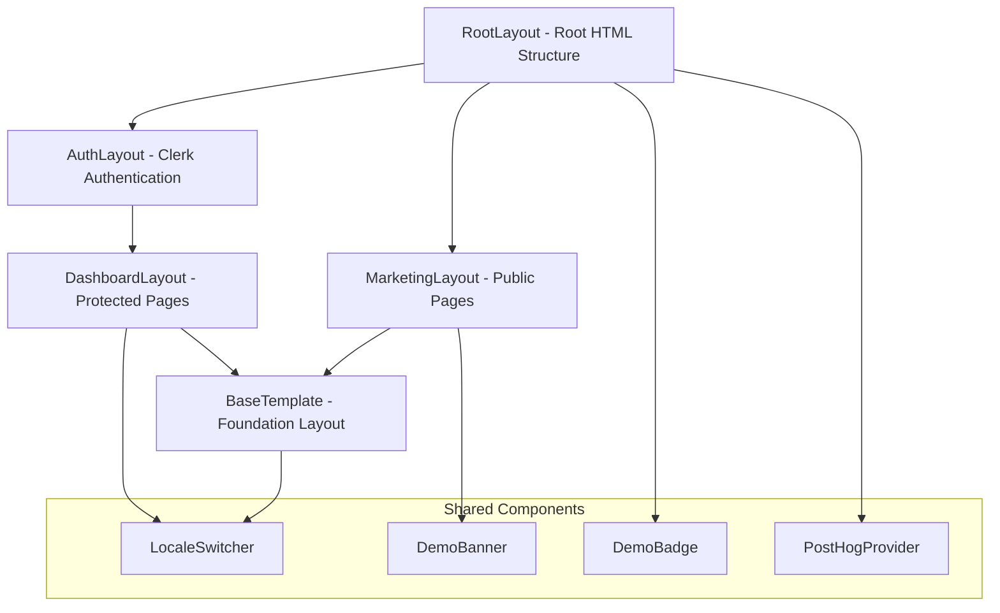
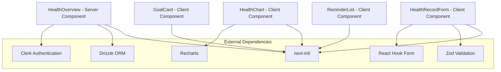
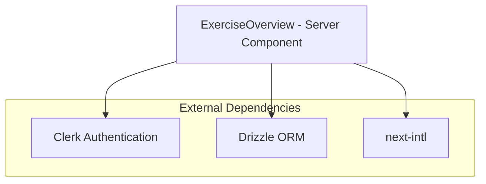
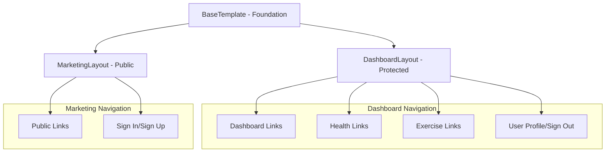
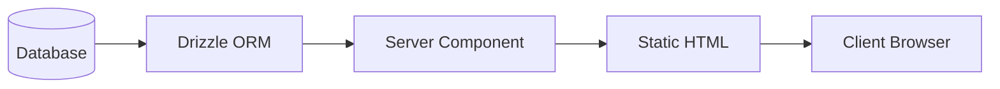
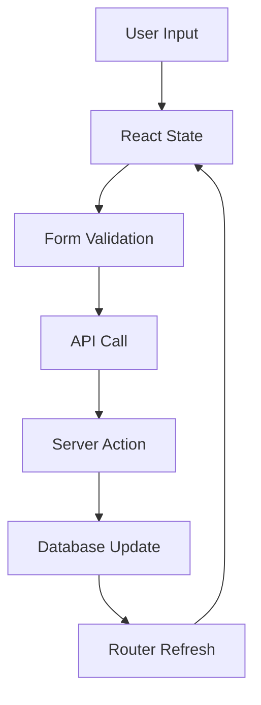
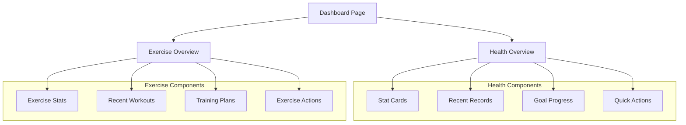

# Component Dependency Graph Analysis

This document provides a comprehensive analysis of component relationships, dependencies, and architectural patterns in the Next.js health management application.

## 1. Component Hierarchy Mapping

### Core Layout Hierarchy



### Health Management Component Dependencies



### Exercise Management Component Dependencies



## 2. Server vs Client Component Patterns

### Server Components (Data Fetching)

**Characteristics:**
- Async functions that fetch data on the server
- Direct database access via Drizzle ORM
- Server-side translations with `getTranslations`
- No client-side interactivity

**Components:**
- `HealthOverview` - Fetches health records, goals, and statistics
- `ExerciseOverview` - Fetches exercise logs and training plans
- Layout components (`BaseTemplate`, `DashboardLayout`, `MarketingLayout`)

**Data Flow Pattern:**
```
Database → Drizzle ORM → Server Component → Static HTML → Client
```

### Client Components (Interactivity)

**Characteristics:**
- Use `'use client'` directive
- Handle user interactions and state management
- Client-side translations with `useTranslations`
- Form handling and validation

**Components:**
- `HealthRecordForm` - Form interactions and validation
- `HealthChart` - Interactive data visualization
- `CounterForm` - Simple form example
- `LocaleSwitcher` - Language switching

**State Management Pattern:**
```
User Interaction → React State → Component Re-render → API Call → Server Action
```

### Hybrid Composition Strategy

Server components compose client components to create optimal user experiences:

```typescript
// Server Component (HealthOverview)
export const HealthOverview = async () => {
  const data = await fetchHealthData(); // Server-side data fetching

  return (
    <div>
      {/* Server-rendered static content */}
      <StatCard data={data.stats} />

      {/* Client component for interactivity */}
      <HealthChart data={data.chartData} />
    </div>
  );
};
```

## 3. Layout Component Dependencies

### BaseTemplate Foundation

**Role:** Core layout foundation providing consistent structure
**Dependencies:**
- `next-intl` for translations
- `AppConfig` for application metadata

**Composition Pattern:**
```typescript
BaseTemplate({
  leftNav: React.ReactNode, // Navigation links
  rightNav: React.ReactNode, // User actions
  children: React.ReactNode // Page content
});
```

### Layout Inheritance Chain



### Navigation Component Integration

Both layouts integrate `LocaleSwitcher` for internationalization:
- **Reusability:** Same component used across different layouts
- **Consistency:** Uniform language switching experience
- **Positioning:** Placed in `rightNav` slot of BaseTemplate

## 4. Shared Component Reusability

### LocaleSwitcher - High Reusability

**Usage Locations:**
- `DashboardLayout` (authenticated users)
- `MarketingLayout` (public pages)

**Reusability Pattern:**
```typescript
// Consistent integration across layouts
rightNav={(
  <>
    {/* Other navigation items */}
    <li>
      <LocaleSwitcher />
    </li>
  </>
)}
```

**Dependencies:**
- `next-intl` for locale management
- `next/navigation` for routing
- Custom `I18nNavigation` utilities

### Form Components Reusability

**HealthRecordForm Pattern:**
- Configurable for create/edit modes
- Reusable validation schema
- Consistent error handling
- Standardized success feedback

**Reusability Features:**
```typescript
type HealthRecordFormProps = {
  initialData?: Partial<HealthRecordFormData>;
  onSuccess?: () => void;
  mode?: 'create' | 'edit';
  recordId?: number;
};
```

### Chart Components Reusability

**HealthChart Flexibility:**
- Multiple chart types (line, bar, area)
- Configurable styling and behavior
- Consistent loading/error states
- Reusable across different health metrics

**Configuration Options:**
```typescript
type HealthChartProps = {
  chartType?: 'line' | 'bar' | 'area';
  color?: string;
  showGrid?: boolean;
  showLegend?: boolean;
  goalValue?: number;
  // ... extensive customization options
};
```

## 5. Data Flow Dependencies

### Server Component Data Flow



**Example - HealthOverview Data Flow:**
1. `currentUser()` from Clerk authentication
2. Database queries via Drizzle ORM
3. Data transformation and aggregation
4. Server-side rendering with translations
5. Static HTML delivery to client

### Client Component State Management



**Example - HealthRecordForm Flow:**
1. User fills form fields
2. React Hook Form manages state
3. Zod validation on submit
4. Fetch API call to server
5. Server updates database
6. Router refresh triggers re-render

### Props Drilling Patterns

**Minimal Props Drilling:**
- Server components fetch data at the top level
- Data passed down as props to immediate children
- Client components manage their own state

**Example Pattern:**
```typescript
// Server Component
const HealthOverview = async () => {
  const data = await fetchData();

  return (
    <div>
      <StatCard stats={data.stats} />
      <RecentRecords records={data.recentRecords} />
      <GoalProgress goals={data.activeGoals} />
    </div>
  );
};
```

## 6. External Library Dependencies

### Recharts Integration (HealthChart)

**Integration Pattern:**
```typescript
import {
  AreaChart,
  BarChart,
  LineChart,
  ResponsiveContainer,
  Tooltip,
  XAxis,
  YAxis
} from 'recharts';
```

**Abstraction Layer:**
- Custom `HealthChart` component wraps Recharts
- Provides consistent styling and behavior
- Handles loading/error states
- Responsive design built-in

### React Hook Form + Zod Pattern

**Consistent Integration:**
```typescript
const form = useForm<FormData>({
  resolver: zodResolver(ValidationSchema),
  defaultValues: { /* ... */ }
});
```

**Used In:**
- `HealthRecordForm`
- `CounterForm`
- Future form components

### next-intl Integration

**Server Components:**
```typescript
const t = await getTranslations('Namespace');
```

**Client Components:**
```typescript
const t = useTranslations('Namespace');
```

**Consistent Pattern:**
- Namespace-based organization
- Type-safe translation keys
- Fallback handling

### Clerk Authentication

**Server-Side Integration:**
```typescript
import { currentUser } from '@clerk/nextjs/server';

const user = await currentUser();
if (!user) {
  return null;
}
```

**Layout Integration:**
```typescript
<ClerkProvider
  localization={clerkLocale}
  signInUrl={signInUrl}
  signUpUrl={signUpUrl}
>
  {children}
</ClerkProvider>
```

## 7. Component Composition Patterns

### Dashboard Overview Composition



### Form Component Composition

**Layered Architecture:**
1. **Validation Layer:** Zod schemas
2. **Form Management:** React Hook Form
3. **UI Layer:** Form components
4. **API Layer:** Fetch calls
5. **State Management:** Router refresh

### Chart Component Composition

**Flexible Architecture:**
```typescript
<HealthChart
  data={healthData}
  chartType="line"
  goalValue={targetValue}
  showGrid={true}
  color="#3b82f6"
/>
```

**Composition Benefits:**
- Single component handles multiple chart types
- Consistent styling across all charts
- Built-in responsive behavior
- Standardized loading/error states

## 8. Testing Dependencies

### Component Testing Patterns

**Mock Dependencies:**
- Clerk authentication mocked
- Database queries mocked
- Translation functions mocked
- Router functions mocked

**Testing Structure:**
```typescript
// HealthOverview.test.tsx
describe('HealthOverview', () => {
  beforeEach(() => {
    // Mock external dependencies
    mockCurrentUser();
    mockDatabaseQueries();
    mockTranslations();
  });

  it('renders health statistics', () => {
    // Test component rendering
  });
});
```

### Integration Testing

**Component Integration:**
- Form submission workflows
- Chart data rendering
- Navigation interactions
- Authentication flows

## 9. Performance Considerations

### Server Component Optimization

**Benefits:**
- Zero JavaScript bundle for static content
- Server-side data fetching reduces client requests
- Automatic code splitting at component boundaries

**Implementation:**
```typescript
// Server component - no client JavaScript
export const HealthOverview = async () => {
  const data = await fetchHealthData(); // Server-side only
  return <StaticContent data={data} />;
};
```

### Client Component Optimization

**Lazy Loading Strategy:**
```typescript
// Dynamic imports for heavy components
const HealthChart = dynamic(() => import('./HealthChart'), {
  loading: () => <ChartSkeleton />,
  ssr: false // Client-side only for interactivity
});
```

### Bundle Optimization

**Library Usage:**
- Recharts: Tree-shaken imports
- React Hook Form: Minimal bundle impact
- next-intl: Automatic code splitting by locale

### Caching Strategy

**Server Components:**
- Database query results cached
- Static generation where possible
- Incremental Static Regeneration (ISR)

**Client Components:**
- React Query for API caching (future enhancement)
- Browser caching for static assets
- Service worker caching (future enhancement)

## Architecture Decision Guidelines

### When to Use Server Components

✅ **Use for:**
- Data fetching from databases
- Static content rendering
- SEO-critical content
- Initial page loads

❌ **Avoid for:**
- User interactions
- Form handling
- Real-time updates
- Client-side state management

### When to Use Client Components

✅ **Use for:**
- Form interactions
- Data visualization
- User input handling
- Real-time features

❌ **Avoid for:**
- Initial data fetching
- Static content
- SEO-critical rendering

### Component Composition Best Practices

1. **Single Responsibility:** Each component has one clear purpose
2. **Prop Interface Design:** Clear, typed interfaces for all props
3. **Error Boundaries:** Graceful error handling at component boundaries
4. **Loading States:** Consistent loading indicators across components
5. **Accessibility:** ARIA labels and keyboard navigation support

This dependency analysis provides a comprehensive foundation for understanding the component architecture and making informed decisions about component design, reusability, and performance optimization.
