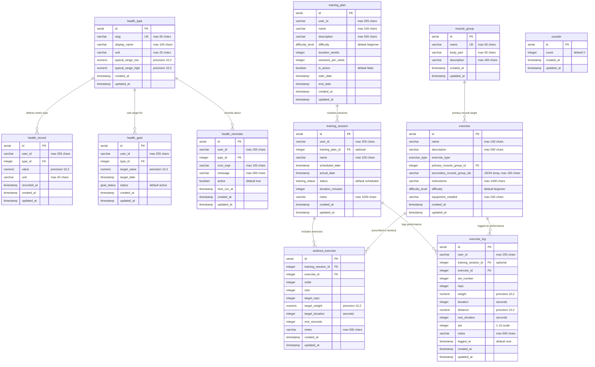

# Entity Relationship Diagram

This document provides a detailed visual representation of the database schema relationships from `src/models/Schema.ts`, showing how all entities connect and interact within the health and exercise management system.

## ERD Visualization



## Relationship Cardinalities

### One-to-Many Relationships

#### Health Management Domain

1. **health_type → health_record** (1:N)
   - **Cardinality**: One health type can have many health records
   - **Foreign Key**: `health_record.type_id` → `health_type.id`
   - **Business Logic**: Each health metric (weight, blood pressure, etc.) can have multiple measurements over time
   - **Indexed**: Yes, composite index on (user_id, type_id)

2. **health_type → health_goal** (1:N)
   - **Cardinality**: One health type can have many goals
   - **Foreign Key**: `health_goal.type_id` → `health_type.id`
   - **Business Logic**: Users can set multiple goals for the same health metric (e.g., quarterly weight goals)
   - **Indexed**: Yes, composite index on (user_id, type_id)

3. **health_type → health_reminder** (1:N)
   - **Cardinality**: One health type can have many reminders
   - **Foreign Key**: `health_reminder.type_id` → `health_type.id`
   - **Business Logic**: Multiple reminder schedules can be set for the same health metric
   - **Indexed**: Yes, composite index on (user_id, type_id)

#### Exercise Management Domain

4. **muscle_group → exercise** (1:N)
   - **Cardinality**: One muscle group can be the primary target for many exercises
   - **Foreign Key**: `exercise.primary_muscle_group_id` → `muscle_group.id`
   - **Business Logic**: Each exercise has one primary muscle group, but a muscle group can be targeted by many exercises
   - **Indexed**: Yes, single index on primary_muscle_group_id
   - **Additional**: Secondary muscle groups stored as JSON array in `secondary_muscle_group_ids`

5. **training_plan → training_session** (1:N)
   - **Cardinality**: One training plan can have many sessions
   - **Foreign Key**: `training_session.training_plan_id` → `training_plan.id`
   - **Business Logic**: Training plans contain multiple scheduled workout sessions
   - **Constraints**: Optional relationship - sessions can exist without a formal plan
   - **Indexed**: Yes, composite index on (training_plan_id, scheduled_date)

6. **training_session → workout_exercise** (1:N)
   - **Cardinality**: One training session can include many exercises
   - **Foreign Key**: `workout_exercise.training_session_id` → `training_session.id`
   - **Business Logic**: Each workout session contains multiple exercises with specific prescriptions
   - **Ordering**: Uses `order` field to maintain exercise sequence
   - **Indexed**: Yes, composite index on (training_session_id, order)

7. **exercise → workout_exercise** (1:N)
   - **Cardinality**: One exercise can be used in many workout prescriptions
   - **Foreign Key**: `workout_exercise.exercise_id` → `exercise.id`
   - **Business Logic**: Exercise library entries can be reused across different workouts with varying prescriptions
   - **Flexibility**: Same exercise can have different sets/reps/weight prescriptions

8. **training_session → exercise_log** (1:N)
   - **Cardinality**: One training session can have many exercise logs
   - **Foreign Key**: `exercise_log.training_session_id` → `training_session.id`
   - **Business Logic**: Performance logging for all exercises within a session
   - **Constraints**: Optional relationship - logs can exist without formal sessions
   - **Indexed**: Yes, composite index on (training_session_id, exercise_id)

9. **exercise → exercise_log** (1:N)
   - **Cardinality**: One exercise can have many performance log entries
   - **Foreign Key**: `exercise_log.exercise_id` → `exercise.id`
   - **Business Logic**: Historical performance tracking for each exercise type
   - **Granularity**: Set-level logging with `set_number` field

## Entity Groupings

### Health Management Cluster
```
health_type (Master Data)
├── health_record (Transactional)
├── health_goal (Goal Setting)
└── health_reminder (Automation)
```

**Characteristics**:
- Centered around health metric types
- User data isolation through user_id
- Time-series data pattern in health_record
- Business process support (goals, reminders)

### Exercise Management Cluster
```
muscle_group (Master Data)
└── exercise (Exercise Library)
    ├── workout_exercise (Prescriptions)
    └── exercise_log (Performance Tracking)

training_plan (Program Management)
└── training_session (Workout Sessions)
    ├── workout_exercise (Exercise Prescriptions)
    └── exercise_log (Performance Logs)
```

**Characteristics**:
- Dual hierarchy: Exercise-based and Session-based
- Master data (muscle_group, exercise) shared across users
- User data isolation in training_plan, training_session, exercise_log
- Flexible relationship between prescriptions and actual performance

## Data Flow Patterns

### Health Tracking Flow
1. **Setup**: health_type defines trackable metrics
2. **Recording**: health_record captures measurements
3. **Goal Setting**: health_goal defines targets
4. **Automation**: health_reminder schedules notifications
5. **Analysis**: Cross-reference records against goals

### Exercise Management Flow

#### Planning Flow
1. **Library Setup**: muscle_group and exercise define available exercises
2. **Program Creation**: training_plan structures workout programs
3. **Session Scheduling**: training_session schedules individual workouts
4. **Exercise Prescription**: workout_exercise defines specific exercise parameters

#### Execution Flow
1. **Session Start**: training_session status changes to 'in_progress'
2. **Exercise Logging**: exercise_log captures actual performance
3. **Session Completion**: training_session status updates to 'completed'
4. **Progress Tracking**: Compare exercise_log against workout_exercise targets

### Cross-Domain Integration
- Users tracked in both health and exercise domains via user_id
- Potential integration points:
  - Exercise minutes → health_record
  - Weight from health_record → exercise_log weight tracking
  - Cardio performance → health metrics

## Referential Integrity Rules

### Cascade Behaviors
The schema uses default RESTRICT behavior for foreign key constraints:
- **Delete Restriction**: Cannot delete referenced records (e.g., health_type with existing health_records)
- **Update Cascades**: Primary key updates would cascade to foreign keys (rare in practice with serial IDs)

### Optional vs Required Relationships

#### Required Relationships (NOT NULL Foreign Keys)
- health_record.type_id → health_type.id
- health_goal.type_id → health_type.id
- health_reminder.type_id → health_type.id
- exercise.primary_muscle_group_id → muscle_group.id
- workout_exercise.training_session_id → training_session.id
- workout_exercise.exercise_id → exercise.id
- exercise_log.exercise_id → exercise.id

#### Optional Relationships (Nullable Foreign Keys)
- training_session.training_plan_id → training_plan.id
- exercise_log.training_session_id → training_session.id

### Data Consistency Patterns

#### Time-Series Consistency
- All tables include created_at and updated_at timestamps
- updated_at automatically refreshes on record modification
- Temporal queries supported through strategic indexing

#### User Data Partitioning
- Consistent user_id field across all user-specific tables
- No cross-user data references
- User-based composite indexes for query optimization

#### Enumeration Consistency
- Shared difficulty_level enum between exercise and training_plan
- Consistent status tracking patterns across domains
- Default values provide sensible initial states

## Index Performance Implications

### Query Optimization Strategy
- **User-centric queries**: All user data indexed by user_id
- **Temporal queries**: Date-based indexes for time-series analysis
- **Lookup optimization**: Foreign key relationships indexed
- **Business logic support**: Composite indexes for common query patterns

### Index Maintenance Considerations
- Composite indexes optimized for most common query patterns
- Balance between read performance and write overhead
- Strategic index placement on high-cardinality foreign keys

This comprehensive entity relationship analysis provides the foundation for understanding data relationships, query patterns, and system scalability within the health and exercise management platform.
