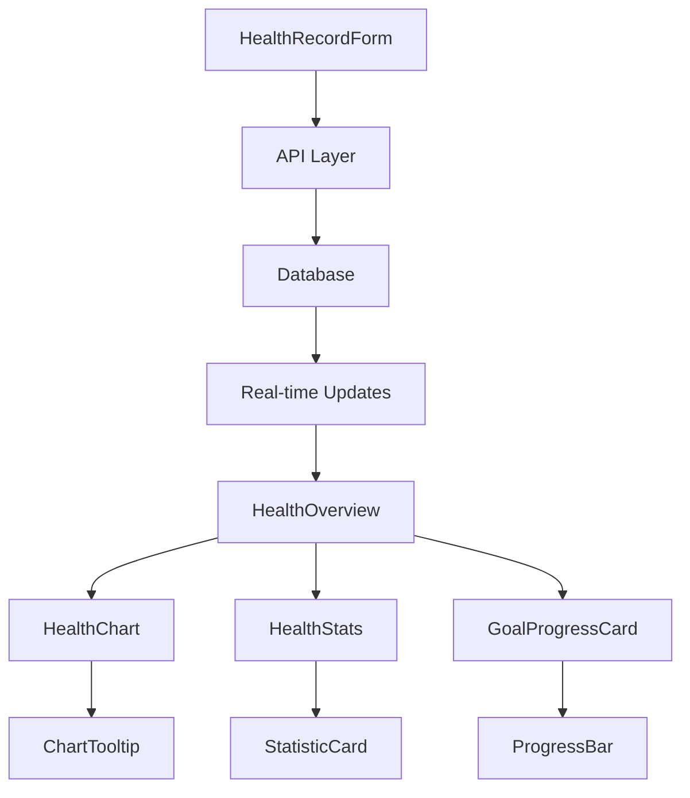

# Requirements Traceability Matrix - Part 3: UI Components and User Workflow Mapping

## Table of Contents
1. [Overview and Navigation](#overview-and-navigation)
2. [Functional Requirements to UI Components Mapping](#functional-requirements-to-ui-components-mapping)
3. [UI Components to Requirements Mapping](#ui-components-to-requirements-mapping)
4. [User Workflow to Page/Component Mapping](#user-workflow-to-pagecomponent-mapping)
5. [Form Handling and Validation Mapping](#form-handling-and-validation-mapping)
6. [Navigation and Layout Mapping](#navigation-and-layout-mapping)
7. [Component Integration Patterns](#component-integration-patterns)
8. [Internationalization UI Mapping](#internationalization-ui-mapping)

## Overview and Navigation

### Part 3 Scope
This section establishes traceability between functional requirements and their user interface implementation through React components, user workflows, and interaction patterns. It bridges business functionality with user experience design.

### Cross-References
- **Part 1**: Business Requirements and User Stories → [requirements-traceability-matrix-part1.md](requirements-traceability-matrix-part1.md)
- **Part 2**: Database and API Implementation → [requirements-traceability-matrix-part2.md](requirements-traceability-matrix-part2.md)
- **Part 4**: Non-Functional Requirements → [requirements-traceability-matrix-part4.md](requirements-traceability-matrix-part4.md)
- **Part 5**: Test Coverage and Validation → [requirements-traceability-matrix-part5.md](requirements-traceability-matrix-part5.md)
- **Part 6**: Change Impact and Compliance → [requirements-traceability-matrix-part6.md](requirements-traceability-matrix-part6.md)

## Functional Requirements to UI Components Mapping

### Health Management UI Components

#### Health Record Management
| Functional Requirement | UI Component | Component Location | User Interaction | State Management |
|----------------------|--------------|-------------------|------------------|------------------|
| FR-HLT-001: Configurable health types | `HealthTypeSelector` | `src/components/health/HealthTypeSelector.tsx` | Dropdown selection | Local state + API |
| FR-HLT-002: Validate health inputs | `HealthRecordForm` | `src/components/health/HealthRecordForm.tsx` | Form validation | React Hook Form |
| FR-HLT-003: Real-time feedback | `HealthRecordForm` | Form validation display | Inline error messages | Validation state |
| FR-HLT-004: Store health records | `HealthRecordForm` | Form submission | Submit button + loading | API integration |

#### Health Data Visualization
| Functional Requirement | UI Component | Component Location | User Interaction | Data Source |
|----------------------|--------------|-------------------|------------------|-------------|
| FR-HLT-006: Data visualizations | `HealthChart` | `src/components/health/HealthChart.tsx` | Chart interactions | Analytics API |
| FR-HLT-006: Data visualizations | `HealthOverview` | `src/components/health/HealthOverview.tsx` | Dashboard view | Multiple APIs |
| FR-HLT-007: Time-based filtering | `DateRangeFilter` | `src/components/health/DateRangeFilter.tsx` | Date picker | Filter state |
| FR-HLT-008: Health statistics | `HealthStats` | `src/components/health/HealthStats.tsx` | Metric display | Statistics API |

#### Health Goals Management
| Functional Requirement | UI Component | Component Location | User Interaction | Workflow |
|----------------------|--------------|-------------------|------------------|----------|
| FR-HLT-010: Goal creation | `HealthGoalForm` | `src/components/health/HealthGoalForm.tsx` | Goal setup form | Create → Save → View |
| FR-HLT-011: Goal progress | `GoalProgressCard` | `src/components/health/GoalProgressCard.tsx` | Progress visualization | Auto-updating display |
| FR-HLT-012: Achievement metrics | `GoalAchievementBadge` | `src/components/health/GoalAchievementBadge.tsx` | Achievement display | Progress calculation |
| FR-HLT-013: Goal management | `GoalManagementPanel` | `src/components/health/GoalManagementPanel.tsx` | CRUD operations | Edit → Update → Refresh |

#### Health Reminders Interface
| Functional Requirement | UI Component | Component Location | User Interaction | Notification Integration |
|----------------------|--------------|-------------------|------------------|-------------------------|
| FR-HLT-014: Reminder scheduling | `ReminderSetupForm` | `src/components/health/ReminderSetupForm.tsx` | Schedule configuration | Cron expression builder |
| FR-HLT-015: Reminder notifications | `ReminderNotification` | `src/components/health/ReminderNotification.tsx` | Notification display | Browser notifications |
| FR-HLT-016: Reminder customization | `ReminderCustomizer` | `src/components/health/ReminderCustomizer.tsx` | Settings panel | Preference management |
| FR-HLT-017: Reminder management | `ReminderControls` | `src/components/health/ReminderControls.tsx` | Snooze/dismiss actions | Action handling |

### Exercise Management UI Components

#### Exercise Library Interface
| Functional Requirement | UI Component | Component Location | User Interaction | Search Integration |
|----------------------|--------------|-------------------|------------------|-------------------|
| FR-EXE-001: Exercise database | `ExerciseLibrary` | `src/components/exercise/ExerciseLibrary.tsx` | Browse exercises | Pagination + filtering |
| FR-EXE-002: Exercise categorization | `ExerciseCategoryFilter` | `src/components/exercise/ExerciseCategoryFilter.tsx` | Category selection | Filter state management |
| FR-EXE-003: Exercise search | `ExerciseSearchBar` | `src/components/exercise/ExerciseSearchBar.tsx` | Search input | Debounced search API |
| FR-EXE-004: Exercise details | `ExerciseDetailModal` | `src/components/exercise/ExerciseDetailModal.tsx` | Modal display | Exercise data loading |

#### Training Plan Management
| Functional Requirement | UI Component | Component Location | User Interaction | Plan Builder |
|----------------------|--------------|-------------------|------------------|---------------|
| FR-EXE-005: Plan creation | `TrainingPlanBuilder` | `src/components/exercise/TrainingPlanBuilder.tsx` | Drag-and-drop interface | Complex state management |
| FR-EXE-006: Plan templates | `PlanTemplateSelector` | `src/components/exercise/PlanTemplateSelector.tsx` | Template browsing | Template loading |
| FR-EXE-007: Plan customization | `PlanCustomizer` | `src/components/exercise/PlanCustomizer.tsx` | Exercise modification | Plan structure editing |
| FR-EXE-008: Plan validation | `PlanValidationAlert` | `src/components/exercise/PlanValidationAlert.tsx` | Validation feedback | Error display |

#### Workout Session Interface
| Functional Requirement | UI Component | Component Location | User Interaction | Session Flow |
|----------------------|--------------|-------------------|------------------|--------------|
| FR-EXE-009: Session logging | `WorkoutSessionTracker` | `src/components/exercise/WorkoutSessionTracker.tsx` | Exercise recording | Timer + progress |
| FR-EXE-010: Performance metrics | `ExerciseSetLogger` | `src/components/exercise/ExerciseSetLogger.tsx` | Set/rep/weight input | Performance capture |
| FR-EXE-011: Workout statistics | `WorkoutStatsPanel` | `src/components/exercise/WorkoutStatsPanel.tsx` | Statistics display | Analytics visualization |
| FR-EXE-012: Progress visualization | `WorkoutProgressChart` | `src/components/exercise/WorkoutProgressChart.tsx` | Progress charts | Trend analysis |

### Authentication and User Interface Components

#### Authentication Flow
| Functional Requirement | UI Component | Component Location | User Interaction | Auth Integration |
|----------------------|--------------|-------------------|------------------|-----------------|
| FR-AUT-001: Multiple auth methods | `SignInButton` | Clerk components | OAuth selection | Clerk integration |
| FR-AUT-002: Multi-factor auth | `MFASetup` | Clerk components | MFA configuration | Clerk MFA flow |
| FR-AUT-003: Session management | `UserButton` | Clerk components | User menu | Session controls |
| FR-AUT-004: Password policies | `PasswordStrengthIndicator` | Clerk components | Password feedback | Policy validation |

## UI Components to Requirements Mapping

### Core Health Components Analysis

#### HealthOverview Component
**Component Path**: `src/components/health/HealthOverview.tsx`
**Supporting Requirements**: FR-HLT-006, FR-HLT-007, FR-HLT-008, FR-HLT-011
```typescript
type HealthOverviewProps = {
  userId: string;
  dateRange: DateRange;
  selectedMetrics: HealthType[];
};
```
**Functionality Mapping**:
- **Data Visualization** (FR-HLT-006): Renders multiple chart types for health metrics
- **Time Filtering** (FR-HLT-007): Integrates with DateRangeFilter for data filtering
- **Statistics Display** (FR-HLT-008): Shows calculated health statistics
- **Goal Progress** (FR-HLT-011): Displays goal progress indicators

**State Management**:
- Fetches data from multiple API endpoints
- Manages loading and error states
- Implements responsive chart rendering
- Handles real-time data updates

#### HealthRecordForm Component
**Component Path**: `src/components/health/HealthRecordForm.tsx`
**Supporting Requirements**: FR-HLT-001, FR-HLT-002, FR-HLT-003, FR-HLT-004, FR-HLT-005
```typescript
type HealthRecordFormProps = {
  onSubmit: (data: HealthRecordData) => Promise<void>;
  healthTypes: HealthType[];
  initialData?: HealthRecord;
};
```
**Functionality Mapping**:
- **Type Selection** (FR-HLT-001): Dynamic form fields based on health type
- **Input Validation** (FR-HLT-002): Zod schema integration with form validation
- **Real-time Feedback** (FR-HLT-003): Live validation with error messages
- **Data Submission** (FR-HLT-004): Secure API integration for record creation
- **Duplicate Prevention** (FR-HLT-005): Timestamp validation and conflict handling

**Form Integration**:
- React Hook Form for form state management
- Zod resolver for schema validation
- Custom validation rules for health metrics
- Optimistic UI updates with rollback

### Exercise Management Components Analysis

#### ExerciseLibrary Component
**Component Path**: `src/components/exercise/ExerciseLibrary.tsx`
**Supporting Requirements**: FR-EXE-001, FR-EXE-002, FR-EXE-003, FR-EXE-004
```typescript
type ExerciseLibraryProps = {
  onExerciseSelect?: (exercise: Exercise) => void;
  allowMultiSelect?: boolean;
  categoryFilter?: string[];
};
```
**Functionality Mapping**:
- **Exercise Database** (FR-EXE-001): Displays paginated exercise collection
- **Categorization** (FR-EXE-002): Category-based filtering and organization
- **Search Capability** (FR-EXE-003): Real-time search with debouncing
- **Detail Display** (FR-EXE-004): Exercise detail modal integration

**Performance Optimizations**:
- Virtualized scrolling for large exercise lists
- Lazy loading of exercise images
- Memoized filter operations
- Optimistic search result updates

#### TrainingPlanBuilder Component
**Component Path**: `src/components/exercise/TrainingPlanBuilder.tsx`
**Supporting Requirements**: FR-EXE-005, FR-EXE-006, FR-EXE-007, FR-EXE-008
```typescript
type TrainingPlanBuilderProps = {
  initialPlan?: TrainingPlan;
  templates: PlanTemplate[];
  onSave: (plan: TrainingPlan) => Promise<void>;
};
```
**Functionality Mapping**:
- **Plan Creation** (FR-EXE-005): Wizard-style plan building interface
- **Template Integration** (FR-EXE-006): Template selection and customization
- **Plan Customization** (FR-EXE-007): Drag-and-drop exercise arrangement
- **Validation Feedback** (FR-EXE-008): Real-time plan validation with warnings

**Complex State Management**:
- Multi-step form with state persistence
- Undo/redo functionality for plan modifications
- Auto-save with conflict resolution
- Preview mode for plan visualization

### Layout and Navigation Components

#### BaseTemplate Component
**Component Path**: `src/templates/BaseTemplate.tsx`
**Supporting Requirements**: FR-I18N-001, FR-ACC-001, FR-ACC-002
```typescript
type BaseTemplateProps = {
  children: React.ReactNode;
  meta: TemplateMetaProps;
};
```
**Functionality Mapping**:
- **Language Switching** (FR-I18N-001): Integrated locale switcher
- **Keyboard Navigation** (FR-ACC-001): Focus management and tab order
- **Screen Reader Support** (FR-ACC-002): ARIA landmarks and labels

**Accessibility Features**:
- Skip navigation links
- High contrast mode toggle
- Keyboard shortcut support
- Screen reader announcements

#### DashboardLayout Component
**Component Path**: `src/app/[locale]/(auth)/dashboard/layout.tsx`
**Supporting Requirements**: Navigation, User Experience, Security
```typescript
type DashboardLayoutProps = {
  children: React.ReactNode;
  params: { locale: string };
};
```
**Layout Responsibilities**:
- Authenticated route protection
- Navigation menu with active state
- Responsive sidebar management
- User context provision

## User Workflow to Page/Component Mapping

### Health Management User Journeys

#### Health Data Entry Workflow
| User Step | Page/Component | User Action | System Response | Supporting FRs |
|-----------|----------------|-------------|-----------------|---------------|
| 1. Navigate to health dashboard | `/dashboard/health` | Page navigation | Load HealthOverview | FR-HLT-006 |
| 2. Click "Add Record" | HealthOverview | Button click | Open HealthRecordForm modal | FR-HLT-004 |
| 3. Select health type | HealthRecordForm | Dropdown selection | Load type-specific form fields | FR-HLT-001 |
| 4. Enter health value | HealthRecordForm | Input field | Real-time validation feedback | FR-HLT-002, FR-HLT-003 |
| 5. Submit record | HealthRecordForm | Form submission | Save to database, update UI | FR-HLT-004, FR-HLT-005 |
| 6. View updated data | HealthOverview | Automatic refresh | Display new record in chart | FR-HLT-006 |

#### Health Goal Management Workflow
| User Step | Page/Component | User Action | System Response | Supporting FRs |
|-----------|----------------|-------------|-----------------|---------------|
| 1. Access goals section | `/dashboard/health/goals` | Navigation | Load GoalManagementPanel | FR-HLT-010 |
| 2. Create new goal | GoalManagementPanel | "New Goal" button | Open HealthGoalForm | FR-HLT-010 |
| 3. Configure goal details | HealthGoalForm | Form completion | Validate goal parameters | FR-HLT-010 |
| 4. Save goal | HealthGoalForm | Submit button | Create goal, calculate baseline | FR-HLT-011 |
| 5. Monitor progress | GoalProgressCard | Automatic updates | Display progress visualization | FR-HLT-011, FR-HLT-012 |

### Exercise Management User Journeys

#### Exercise Discovery and Selection Workflow
| User Step | Page/Component | User Action | System Response | Supporting FRs |
|-----------|----------------|-------------|-----------------|---------------|
| 1. Browse exercise library | `/dashboard/exercise/library` | Page navigation | Load ExerciseLibrary | FR-EXE-001 |
| 2. Filter by category | ExerciseCategoryFilter | Category selection | Filter exercise list | FR-EXE-002 |
| 3. Search for specific exercise | ExerciseSearchBar | Search input | Display search results | FR-EXE-003 |
| 4. View exercise details | ExerciseLibrary | Exercise card click | Open ExerciseDetailModal | FR-EXE-004 |
| 5. Add to training plan | ExerciseDetailModal | "Add to Plan" button | Exercise selection confirmation | FR-EXE-007 |

#### Training Plan Creation Workflow
| User Step | Page/Component | User Action | System Response | Supporting FRs |
|-----------|----------------|-------------|-----------------|---------------|
| 1. Start plan creation | `/dashboard/exercise/plans/new` | Navigation | Load TrainingPlanBuilder | FR-EXE-005 |
| 2. Choose plan template | PlanTemplateSelector | Template selection | Load template structure | FR-EXE-006 |
| 3. Customize exercises | PlanCustomizer | Drag-and-drop operations | Update plan structure | FR-EXE-007 |
| 4. Validate plan | TrainingPlanBuilder | Auto-validation | Display validation feedback | FR-EXE-008 |
| 5. Save training plan | TrainingPlanBuilder | Save button | Persist plan to database | FR-EXE-005 |

#### Workout Session Execution Workflow
| User Step | Page/Component | User Action | System Response | Supporting FRs |
|-----------|----------------|-------------|-----------------|---------------|
| 1. Start workout session | `/dashboard/exercise/workout` | "Start Workout" button | Load WorkoutSessionTracker | FR-EXE-009 |
| 2. Log exercise sets | ExerciseSetLogger | Set/rep/weight input | Record performance data | FR-EXE-010 |
| 3. Complete exercise | WorkoutSessionTracker | "Complete Exercise" | Move to next exercise | FR-EXE-009 |
| 4. Finish workout | WorkoutSessionTracker | "Finish Workout" | Save session data | FR-EXE-009 |
| 5. Review performance | WorkoutStatsPanel | Automatic display | Show session statistics | FR-EXE-011 |

### Authentication and Onboarding Workflows

#### User Registration and Setup Workflow
| User Step | Page/Component | User Action | System Response | Supporting FRs |
|-----------|----------------|-------------|-----------------|---------------|
| 1. Access sign-up page | `/sign-up` | Page navigation | Load Clerk SignUp component | FR-AUT-001 |
| 2. Choose auth method | SignUp | OAuth or email selection | Initiate auth flow | FR-AUT-001 |
| 3. Complete authentication | SignUp | Auth completion | Create user session | FR-AUT-003 |
| 4. Setup MFA (optional) | MFASetup | MFA configuration | Enable additional security | FR-AUT-002 |
| 5. Access dashboard | `/dashboard` | Automatic redirect | Load authenticated interface | FR-AUT-003 |

## Form Handling and Validation Mapping

### Health Record Form Validation

#### Real-time Validation Implementation
```typescript
// Supporting FR-HLT-002, FR-HLT-003
const HealthRecordForm: React.FC<HealthRecordFormProps> = ({ onSubmit }) => {
  const form = useForm<HealthRecordData>({
    resolver: zodResolver(CreateHealthRecordSchema),
    mode: 'onChange', // Real-time validation
  });

  return (
    <Form {...form}>
      <FormField
        control={form.control}
        name="value"
        render={({ field, fieldState }) => (
          <FormItem>
            <FormLabel>Health Value</FormLabel>
            <FormControl>
              <Input {...field} type="number" />
            </FormControl>
            <FormMessage>{fieldState.error?.message}</FormMessage>
          </FormItem>
        )}
      />
    </Form>
  );
};
```

**Validation Features**:
- **Immediate Feedback** (FR-HLT-003): onChange validation mode
- **Type-specific Validation** (FR-HLT-002): Dynamic schema based on health type
- **Error Messaging** (FR-I18N-002): Internationalized error messages
- **Accessibility** (FR-ACC-002): ARIA error announcements

#### Form State Management Patterns
| Form Component | State Pattern | Validation Strategy | Supporting FRs |
|----------------|---------------|-------------------|---------------|
| HealthRecordForm | React Hook Form + Zod | Real-time + submit | FR-HLT-002, FR-HLT-003 |
| HealthGoalForm | React Hook Form + Zod | OnBlur + submit | FR-HLT-010 |
| TrainingPlanBuilder | Complex state machine | Multi-step validation | FR-EXE-008 |
| ReminderSetupForm | React Hook Form + custom | Schedule validation | FR-HLT-014 |

### Error Handling and User Feedback

#### Client-Side Error Handling
```typescript
// Supporting FR-HLT-003, User Experience
const useHealthRecordSubmission = () => {
  const [isSubmitting, setIsSubmitting] = useState(false);
  const [error, setError] = useState<string | null>(null);

  const submitRecord = async (data: HealthRecordData) => {
    setIsSubmitting(true);
    setError(null);

    try {
      await createHealthRecord(data);
      toast.success('Health record added successfully');
    } catch (err) {
      setError(err.message);
      toast.error('Failed to add health record');
    } finally {
      setIsSubmitting(false);
    }
  };

  return { submitRecord, isSubmitting, error };
};
```

**Error Handling Features**:
- **User-friendly Messages**: Translated error messages
- **Loading States**: Visual feedback during operations
- **Retry Mechanisms**: Automatic retry for network errors
- **Accessibility**: Screen reader error announcements

### Form Performance and Optimization

#### Optimistic Updates
| Form Type | Optimistic Strategy | Rollback Mechanism | Supporting FRs |
|-----------|-------------------|-------------------|---------------|
| Health Record Form | Immediate UI update | Error rollback with toast | FR-HLT-003, FR-HLT-004 |
| Exercise Logging | Real-time set updates | Session state restoration | FR-EXE-010 |
| Goal Updates | Progress recalculation | Previous state restoration | FR-HLT-011 |

## Navigation and Layout Mapping

### Responsive Navigation Structure

#### Primary Navigation
| Navigation Item | Route | Component | Access Control | Supporting FRs |
|----------------|-------|-----------|----------------|---------------|
| Health Dashboard | `/dashboard/health` | HealthOverview | Authenticated | FR-HLT-006 |
| Health Records | `/dashboard/health/records` | HealthRecordsList | Authenticated | FR-HLT-004 |
| Health Goals | `/dashboard/health/goals` | GoalManagementPanel | Authenticated | FR-HLT-010 |
| Exercise Library | `/dashboard/exercise/library` | ExerciseLibrary | Authenticated | FR-EXE-001 |
| Training Plans | `/dashboard/exercise/plans` | TrainingPlansList | Authenticated | FR-EXE-005 |
| Workout Session | `/dashboard/exercise/workout` | WorkoutSessionTracker | Authenticated | FR-EXE-009 |

#### Breadcrumb Navigation
```typescript
// Supporting FR-ACC-001, User Experience
const Breadcrumb: React.FC<{ items: BreadcrumbItem[] }> = ({ items }) => {
  return (
    <nav aria-label="Breadcrumb">
      <ol className="flex space-x-2">
        {items.map((item, index) => (
          <li key={item.href}>
            <Link href={item.href} className="text-blue-600 hover:underline">
              {item.label}
            </Link>
            {index < items.length - 1 && <span>/</span>}
          </li>
        ))}
      </ol>
    </nav>
  );
};
```

### Layout Responsiveness

#### Mobile-First Navigation
| Breakpoint | Navigation Style | Component Adaptation | Supporting FRs |
|------------|-----------------|---------------------|---------------|
| Mobile (< 768px) | Hamburger menu | Collapsible sidebar | User Experience |
| Tablet (768px - 1024px) | Condensed sidebar | Icon + label navigation | User Experience |
| Desktop (> 1024px) | Full sidebar | Extended navigation menu | User Experience |

#### Keyboard Navigation Support
```typescript
// Supporting FR-ACC-001
const useKeyboardNavigation = () => {
  useEffect(() => {
    const handleKeyDown = (event: KeyboardEvent) => {
      // Alt + H: Navigate to Health Dashboard
      if (event.altKey && event.key === 'h') {
        router.push('/dashboard/health');
      }
      // Alt + E: Navigate to Exercise Library
      if (event.altKey && event.key === 'e') {
        router.push('/dashboard/exercise/library');
      }
    };

    document.addEventListener('keydown', handleKeyDown);
    return () => document.removeEventListener('keydown', handleKeyDown);
  }, []);
};
```

## Component Integration Patterns

### Data Flow Architecture

#### Health Data Component Integration


**Integration Patterns**:
- **Parent-Child Data Flow**: Props drilling for simple data
- **Context Providers**: Shared state for related components
- **Custom Hooks**: Reusable data fetching and state logic
- **Event Emitters**: Cross-component communication

#### Component Composition Patterns
```typescript
// Supporting multiple FRs through composition
const HealthDashboard: React.FC = () => {
  return (
    <DashboardLayout>
      <HealthOverview>
        <HealthChart />
        <HealthStats />
        <GoalProgressCard />
      </HealthOverview>
      <HealthActions>
        <AddRecordButton />
        <SetGoalButton />
        <ExportDataButton />
      </HealthActions>
    </DashboardLayout>
  );
};
```

### State Management Integration

#### Context Providers for Domain Data
```typescript
// Supporting FR-HLT-004, FR-HLT-006, FR-HLT-011
const HealthDataProvider: React.FC<{ children: React.ReactNode }> = ({ children }) => {
  const [healthRecords, setHealthRecords] = useState<HealthRecord[]>([]);
  const [healthGoals, setHealthGoals] = useState<HealthGoal[]>([]);
  const [isLoading, setIsLoading] = useState(true);

  const value = {
    healthRecords,
    healthGoals,
    isLoading,
    addHealthRecord,
    updateGoal,
    refreshData,
  };

  return (
    <HealthDataContext.Provider value={value}>
      {children}
    </HealthDataContext.Provider>
  );
};
```

#### Custom Hooks for Business Logic
```typescript
// Supporting FR-HLT-011, FR-HLT-012
const useGoalProgress = (goalId: string) => {
  const { healthRecords, healthGoals } = useHealthData();

  const progress = useMemo(() => {
    const goal = healthGoals.find(g => g.id === goalId);
    if (!goal) {
      return null;
    }

    const relevantRecords = healthRecords.filter(
      r => r.healthTypeId === goal.healthTypeId
    );

    return calculateGoalProgress(goal, relevantRecords);
  }, [goalId, healthRecords, healthGoals]);

  return progress;
};
```

### Component Mocking and Testing Integration

#### Component Test Structure
```typescript
// Supporting test requirements from Part 5
describe('HealthRecordForm', () => {
  const mockProps = {
    onSubmit: jest.fn(),
    healthTypes: mockHealthTypes,
  };

  beforeEach(() => {
    render(
      <HealthDataProvider>
        <HealthRecordForm {...mockProps} />
      </HealthDataProvider>
    );
  });

  it('validates health input according to FR-HLT-002', async () => {
    // Test implementation
  });

  it('provides real-time feedback per FR-HLT-003', async () => {
    // Test implementation
  });
});
```

## Internationalization UI Mapping

### Locale-Specific Component Behavior

#### Language Switching Implementation
```typescript
// Supporting FR-I18N-001
const LocaleSwitcher: React.FC = () => {
  const { locale } = useParams();
  const router = useRouter();
  const pathname = usePathname();

  const switchLocale = (newLocale: string) => {
    const newPath = pathname.replace(`/${locale}`, `/${newLocale}`);
    router.push(newPath);
  };

  return (
    <Select onValueChange={switchLocale} defaultValue={locale}>
      <SelectTrigger>
        <SelectValue />
      </SelectTrigger>
      <SelectContent>
        <SelectItem value="en">English</SelectItem>
        <SelectItem value="fr">Français</SelectItem>
      </SelectContent>
    </Select>
  );
};
```

#### Localized Content Components
| Component | Localization Features | Translation Keys | Supporting FRs |
|-----------|----------------------|------------------|---------------|
| HealthTypeSelector | Type names, units | `health.types.*` | FR-I18N-002 |
| ExerciseLibrary | Exercise names, descriptions | `exercises.*` | FR-I18N-002 |
| FormValidation | Error messages | `validation.*` | FR-I18N-002 |
| DateRangeFilter | Date formatting | `common.date.*` | FR-I18N-003 |

#### Cultural Adaptation in Components
```typescript
// Supporting FR-I18N-003
const HealthValueDisplay: React.FC<{ value: number; unit: string; locale: string }> = ({
  value,
  unit,
  locale
}) => {
  const formattedValue = new Intl.NumberFormat(locale, {
    minimumFractionDigits: unit === 'kg' ? 1 : 0,
    maximumFractionDigits: unit === 'kg' ? 1 : 0,
  }).format(value);

  return (
    <span className="health-value">
      {formattedValue} {unit}
    </span>
  );
};
```

### Accessibility Integration with I18n

#### Screen Reader Support
```typescript
// Supporting FR-ACC-002, FR-I18N-002
const HealthChart: React.FC<{ data: HealthData[]; locale: string }> = ({ data, locale }) => {
  const { t } = useTranslations('health');

  return (
    <div role="img" aria-labelledby="chart-title" aria-describedby="chart-desc">
      <h3 id="chart-title">{t('chart.title')}</h3>
      <p id="chart-desc">{t('chart.description')}</p>
      <ResponsiveContainer>
        <LineChart data={data}>
          <Line
            dataKey="value"
            name={t('chart.value')}
            aria-label={t('chart.line.description')}
          />
        </LineChart>
      </ResponsiveContainer>
    </div>
  );
};
```

#### High Contrast Mode Integration
```typescript
// Supporting FR-ACC-003, UI Adaptation
const useHighContrast = () => {
  const [isHighContrast, setIsHighContrast] = useState(false);

  useEffect(() => {
    const mediaQuery = window.matchMedia('(prefers-contrast: high)');
    setIsHighContrast(mediaQuery.matches);

    const handler = (e: MediaQueryListEvent) => setIsHighContrast(e.matches);
    mediaQuery.addEventListener('change', handler);

    return () => mediaQuery.removeEventListener('change', handler);
  }, []);

  return isHighContrast;
};
```

### Component Performance with I18n

#### Translation Loading Optimization
| Component Type | Loading Strategy | Caching Approach | Performance Impact |
|----------------|-----------------|------------------|-------------------|
| Static Components | Build-time inclusion | Static JSON | Minimal |
| Dynamic Components | Lazy loading | Runtime caching | Moderate |
| Form Components | Eager loading | Memory caching | Low |
| Chart Components | On-demand loading | Component-level cache | Low |

This completes Part 3 of the Requirements Traceability Matrix, establishing comprehensive mapping between functional requirements and their UI implementation through React components, user workflows, and interaction patterns. Refer to other parts for database implementation, non-functional requirements, testing coverage, and compliance traceability.
