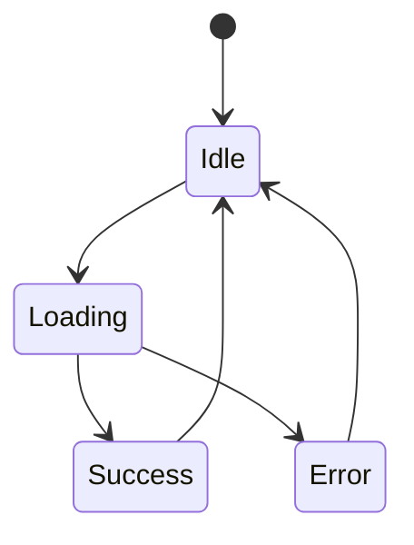

# Component Documentation Template

> **Template Version**: 1.0  
> **Last Updated**: [YYYY-MM-DD]  
> **Component Status**: [Draft | In Development | Stable | Deprecated]

## Component Overview

### Purpose
<!-- Brief description of what this component does and why it exists -->
[Describe the primary purpose and functionality of the component]

### Component Type
- [ ] Server Component
- [ ] Client Component
- [ ] Layout Component
- [ ] Form Component
- [ ] UI Component
- [ ] Utility Component

### Location
**File Path**: `src/components/[category]/[ComponentName].tsx`

### Quick Summary
<!-- One-sentence description for quick reference -->
[Single sentence describing the component's main function]

## Props Interface

### Type Definition
```typescript
export interface [ComponentName]Props {
  // Required props
  [propName]: [type]; // Description of the prop
  
  // Optional props
  [propName]?: [type]; // Description of the prop
  
  // Callback props
  [onEventName]?: ([parameters]) => [returnType]; // Description of the callback
  
  // Styling props
  className?: string; // Additional CSS classes
  
  // Children/content props
  children?: React.ReactNode; // Child components or content
}
```

### Props Documentation

#### Required Props

| Prop Name | Type | Description | Example |
|-----------|------|-------------|---------|
| `[propName]` | `[type]` | [Description] | `[example]` |

#### Optional Props

| Prop Name | Type | Default | Description | Example |
|-----------|------|---------|-------------|---------|
| `[propName]` | `[type]` | `[default]` | [Description] | `[example]` |

#### Callback Props

| Prop Name | Type | Description | Parameters | Return Type |
|-----------|------|-------------|------------|-------------|
| `[onEventName]` | `function` | [Description] | `[parameters]` | `[returnType]` |

### Prop Validation
<!-- Describe any validation rules or constraints -->
- [List validation rules]
- [Describe constraints]
- [Note any Zod schemas used]

## Usage Examples

### Basic Usage
```tsx
import { [ComponentName] } from '@/components/[category]/[ComponentName]';

export default function ExamplePage() {
  return (
    <[ComponentName]
      [requiredProp]="[value]"
      [optionalProp]="[value]"
    />
  );
}
```

### Advanced Usage
```tsx
import { [ComponentName] } from '@/components/[category]/[ComponentName]';

export default function AdvancedExample() {
  const handleEvent = ([parameters]) => {
    // Event handling logic
  };

  return (
    <[ComponentName]
      [requiredProp]="[value]"
      [optionalProp]="[value]"
      [onEventName]={handleEvent}
      className="custom-styles"
    >
      {/* Child content if applicable */}
    </[ComponentName]>
  );
}
```

### With Form Integration
```tsx
import { useForm } from 'react-hook-form';
import { [ComponentName] } from '@/components/[category]/[ComponentName]';

export default function FormExample() {
  const { register, handleSubmit } = useForm();

  return (
    <form onSubmit={handleSubmit(onSubmit)}>
      <[ComponentName]
        {...register('[fieldName]')}
        [additionalProps]
      />
    </form>
  );
}
```

### Server Component Usage
```tsx
// For server components
import { [ComponentName] } from '@/components/[category]/[ComponentName]';
import { getData } from '@/lib/data';

export default async function ServerExample() {
  const data = await getData();

  return (
    <[ComponentName]
      data={data}
      [otherProps]
    />
  );
}
```

## Storybook Stories

### Story Location
**File Path**: `src/components/[category]/[ComponentName].stories.tsx`

### Available Stories

#### Default Story
```typescript
export const Default: Story = {
  args: {
    [propName]: '[defaultValue]',
  },
};
```

#### Variant Stories
- **[VariantName]**: `[ComponentName][VariantName]` - [Description]
- **[VariantName]**: `[ComponentName][VariantName]` - [Description]

#### Interactive Stories
- **[InteractiveName]**: `[ComponentName][InteractiveName]` - [Description]

#### State Stories
- **Loading**: `[ComponentName]Loading` - Component in loading state
- **Error**: `[ComponentName]Error` - Component with error state
- **Empty**: `[ComponentName]Empty` - Component with empty data

### Story Controls
<!-- Document available Storybook controls -->
| Control | Type | Description | Options |
|---------|------|-------------|---------|
| `[controlName]` | `[type]` | [Description] | `[options]` |

### Storybook Documentation
- **Docs Page**: Available in Storybook docs tab
- **Controls**: Interactive controls for testing props
- **Actions**: Event logging for callback props

## Accessibility

### ARIA Support
- **Roles**: [List ARIA roles used]
- **Labels**: [Describe ARIA labels and descriptions]
- **Live Regions**: [Document live regions if applicable]

### Keyboard Navigation
- **Tab Order**: [Describe tab navigation behavior]
- **Keyboard Shortcuts**: [List supported keyboard shortcuts]
- **Focus Management**: [Describe focus behavior]

### Screen Reader Support
- **Semantic HTML**: [Describe semantic structure]
- **Alternative Text**: [Document alt text and descriptions]
- **Content Structure**: [Describe heading hierarchy]

### Accessibility Checklist
- [ ] Proper ARIA attributes
- [ ] Keyboard navigation support
- [ ] Screen reader compatibility
- [ ] Color contrast compliance (WCAG 2.1 AA)
- [ ] Focus indicators visible
- [ ] Alternative text for images/icons
- [ ] Semantic HTML structure

### Testing with Accessibility Tools
- **axe-core**: [Results or notes]
- **WAVE**: [Results or notes]
- **Screen Reader Testing**: [Results with NVDA/JAWS/VoiceOver]

## Testing

### Test Location
**File Path**: `src/components/[category]/[ComponentName].test.tsx`

### Test Coverage Requirements
- [ ] Component renders correctly
- [ ] Props are handled properly
- [ ] User interactions work as expected
- [ ] Error states are handled
- [ ] Accessibility requirements are met
- [ ] Integration with external services

### Unit Tests
```typescript
describe('[ComponentName]', () => {
  it('renders with required props', () => {
    // Test implementation
  });

  it('handles user interactions', () => {
    // Test implementation
  });

  it('displays error states correctly', () => {
    // Test implementation
  });
});
```

### Integration Tests
- **API Integration**: [Describe API integration tests]
- **Form Integration**: [Describe form integration tests]
- **Router Integration**: [Describe routing tests]

### E2E Tests
- **User Flows**: [Describe end-to-end test scenarios]
- **Cross-browser Testing**: [Browser compatibility requirements]

### Mock Requirements
```typescript
// Example mocks needed for testing
vi.mock('@/lib/api', () => ({
  fetchData: vi.fn(),
}));

vi.mock('@clerk/nextjs', () => ({
  useUser: vi.fn(),
}));
```

### Test Data
```typescript
// Example test data structure
const mockData = {
  [property]: '[value]',
  // Additional mock data
};
```

## Dependencies

### External Dependencies
| Package | Version | Purpose | Documentation |
|---------|---------|---------|---------------|
| `[packageName]` | `[version]` | [Purpose] | [Link to docs] |

### Internal Dependencies
| Module | Path | Purpose |
|--------|------|---------|
| `[moduleName]` | `[path]` | [Purpose] |

### Peer Dependencies
- **React**: `^18.0.0`
- **Next.js**: `^15.0.0`
- **TypeScript**: `^5.0.0`

### Optional Dependencies
| Package | Purpose | Fallback Behavior |
|---------|---------|-------------------|
| `[packageName]` | [Purpose] | [Fallback] |

## Integration Points

### Authentication
- **Provider**: [Clerk/Auth0/Custom]
- **Requirements**: [Authentication requirements]
- **Fallback**: [Behavior when unauthenticated]

### Internationalization
- **Provider**: next-intl
- **Translation Keys**: `[namespace].[key]`
- **Locale Support**: [Supported locales]

### State Management
- **Local State**: [React useState/useReducer]
- **Global State**: [Context/Zustand/Redux]
- **Server State**: [SWR/React Query/Server Components]

### API Integration
- **Endpoints**: [List API endpoints used]
- **Methods**: [HTTP methods]
- **Error Handling**: [Error handling strategy]

### Database Integration
- **ORM**: Drizzle ORM
- **Models**: [List database models used]
- **Queries**: [Describe query patterns]

## Performance

### Performance Characteristics
- **Bundle Size**: [Estimated bundle impact]
- **Render Performance**: [Performance considerations]
- **Memory Usage**: [Memory considerations]

### Optimization Strategies
- **Code Splitting**: [Dynamic imports if applicable]
- **Memoization**: [React.memo/useMemo usage]
- **Lazy Loading**: [Lazy loading implementation]

### Performance Metrics
- **First Contentful Paint**: [Target/Actual]
- **Largest Contentful Paint**: [Target/Actual]
- **Cumulative Layout Shift**: [Target/Actual]

### Performance Testing
```typescript
// Example performance test
import { render } from '@testing-library/react';
import { [ComponentName] } from './[ComponentName]';

describe('[ComponentName] Performance', () => {
  it('renders within performance budget', () => {
    const start = performance.now();
    render(<[ComponentName] {...props} />);
    const end = performance.now();
    expect(end - start).toBeLessThan(16); // 60fps budget
  });
});
```

### Performance Monitoring
- **Core Web Vitals**: [Monitoring setup]
- **Bundle Analysis**: [Bundle analyzer results]
- **Runtime Performance**: [Performance profiling]

## Design System Compliance

### Design Tokens
| Token | Value | Usage |
|-------|-------|-------|
| `[tokenName]` | `[value]` | [Usage description] |

### Component Variants
- **Primary**: [Description and usage]
- **Secondary**: [Description and usage]
- **Tertiary**: [Description and usage]

### Spacing System
- **Padding**: [Spacing scale used]
- **Margins**: [Spacing scale used]
- **Gaps**: [Grid/flex gap values]

### Typography
- **Font Family**: [Font stack]
- **Font Sizes**: [Scale used]
- **Line Heights**: [Line height values]
- **Font Weights**: [Weight values]

### Color System
- **Primary Colors**: [Color palette]
- **Secondary Colors**: [Color palette]
- **Semantic Colors**: [Success/Error/Warning colors]

### Responsive Design
- **Breakpoints**: [Mobile/Tablet/Desktop breakpoints]
- **Layout Behavior**: [How component adapts]
- **Touch Targets**: [Minimum touch target sizes]

### Design System Checklist
- [ ] Uses design tokens consistently
- [ ] Follows spacing system
- [ ] Implements responsive design patterns
- [ ] Uses approved color palette
- [ ] Follows typography scale
- [ ] Meets touch target requirements
- [ ] Consistent with other components

## State Management

### Local State
```typescript
// Example state management
const [state, setState] = useState(initialState);
const [loading, setLoading] = useState(false);
const [error, setError] = useState<string | null>(null);
```

### State Patterns
- **Loading States**: [How loading is handled]
- **Error States**: [Error handling patterns]
- **Success States**: [Success feedback patterns]

### State Transitions


## Error Handling

### Error Boundaries
- **Implementation**: [Error boundary usage]
- **Fallback UI**: [Error fallback component]
- **Error Reporting**: [Error tracking integration]

### Error Types
| Error Type | Handling Strategy | User Feedback |
|------------|-------------------|---------------|
| `[ErrorType]` | [Strategy] | [Feedback] |

### Error Recovery
- **Retry Mechanisms**: [Retry strategies]
- **Graceful Degradation**: [Fallback behavior]
- **User Actions**: [Recovery actions available]

## Migration Guide

### Breaking Changes
<!-- Document any breaking changes from previous versions -->
- **Version X.X.X**: [Description of breaking changes]

### Migration Steps
1. [Step 1]
2. [Step 2]
3. [Step 3]

### Deprecation Notices
- **Deprecated Props**: [List deprecated props and alternatives]
- **Deprecated Patterns**: [List deprecated usage patterns]

## Changelog

### Version History
- **v1.0.0** - [YYYY-MM-DD] - Initial implementation
- **v1.1.0** - [YYYY-MM-DD] - [Feature additions]
- **v1.1.1** - [YYYY-MM-DD] - [Bug fixes]

## Related Components

### Component Family
- **[RelatedComponent1]**: [Relationship description]
- **[RelatedComponent2]**: [Relationship description]

### Composition Patterns
```tsx
// Example composition with related components
<[ParentComponent]>
  <[ComponentName] />
  <[SiblingComponent] />
</[ParentComponent]>
```

## Contributing

### Development Setup
1. Clone the repository
2. Install dependencies: `npm install`
3. Start Storybook: `npm run storybook`
4. Run tests: `npm test`

### Code Style
- Follow existing TypeScript patterns
- Use Prettier for formatting
- Follow ESLint rules
- Write comprehensive tests

### Pull Request Checklist
- [ ] Tests pass
- [ ] Storybook stories updated
- [ ] Documentation updated
- [ ] Accessibility tested
- [ ] Performance impact assessed

## Additional Notes

### Known Issues
- [List any known issues or limitations]

### Future Enhancements
- [List planned improvements or features]

### References
- [Design mockups or specifications]
- [Related documentation]
- [External resources]

---

**Template Usage Instructions:**
1. Copy this template for new component documentation
2. Replace all `[placeholder]` values with actual component information
3. Remove sections that don't apply to your component
4. Add component-specific sections as needed
5. Keep documentation updated as component evolves
6. Link to this documentation from component files and Storybook stories

**Maintenance:**
- Review and update documentation with each component change
- Validate all links and examples regularly
- Update version history for significant changes
- Ensure examples remain functional and current